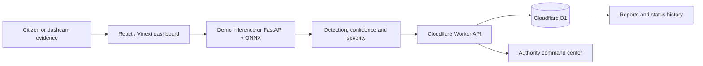

<div align="center">

# CivicLens AI

### Explainable Urban Hazard Detection & Geospatial Reporting Platform

[](https://github.com/AzizulHakim00/CivicLens-AI/actions/workflows/ci.yml)
[](LICENSE)
[](docs/deployment.md)
[](https://www.typescriptlang.org/)
[](https://www.python.org/)

**Computer vision · Geospatial intelligence · Civic reporting · Authority operations · Explainable AI**

### [🚀 Open Live CivicLens AI](https://civiclens-ai.mdomor01815.workers.dev/)

</div>

---

## Overview

CivicLens AI is an end-to-end civic intelligence platform for reporting, verifying, prioritizing, and resolving urban road hazards. It combines a responsive citizen and authority dashboard, geospatial reporting, explainable detection results, severity scoring, duplicate awareness, operational analytics, and a deployable AI inference service.

The project is designed as a complete software product rather than a standalone machine-learning notebook.

> **Model transparency:** The public dashboard currently uses deterministic demo inference because trained production weights and a validated road-hazard dataset are not committed to this repository. The ONNX adapter and training pipeline are ready for real model integration. Demo confidence values and target metrics are not claimed experiment results.

## Live deployment

| Service | Status | Link |
|---|---|---|
| Web dashboard + Worker API | Live on Cloudflare Workers | [Open production app](https://civiclens-ai.mdomor01815.workers.dev/) |
| Report API | Live | [Open `/api/reports`](https://civiclens-ai.mdomor01815.workers.dev/api/reports) |
| D1 database | Connected | `civiclens-production-db` |
| FastAPI/ONNX inference | Optional standalone service | See [`ai-service/`](ai-service/) |

Production is independently hosted in the project owner's Cloudflare account and no longer depends on ChatGPT Sites.

## Core capabilities

### Citizen reporting

- Upload road evidence from desktop or mobile
- Capture or enter GPS/location information
- Review bounding boxes, confidence, and severity
- Receive duplicate-report warnings
- Submit a tracked hazard report

### Urban hazard intelligence

- Pothole
- Plastic waste
- Waterlogging
- Open manhole
- Broken road
- Illegal dumping
- Traffic obstruction
- Damaged streetlight

### Authority operations

- Live hazard map with filters and search
- SLA and priority-based dispatch
- Team assignment and Kanban workflow
- Status history and audit events
- Road-condition and corridor intelligence
- CSV export and operational analytics

### AI and MLOps

- YOLO-format dataset validation
- Reproducible training and evaluation scripts
- Per-class precision/recall and mAP workflow
- Image and video inference endpoints
- ONNX Runtime adapter
- Explainable detection regions
- Transparent demo/real-model separation

## Architecture



The production web application runs as a Cloudflare Worker. Report metadata and workflow history are stored in D1. The optional Python inference service can be deployed separately when trained model weights are available.

Read the full [architecture guide](docs/architecture.md).

## Technology stack

| Layer | Technology |
|---|---|
| Frontend | React 19, TypeScript, Vinext, Tailwind CSS |
| Web runtime | Cloudflare Workers, Vite, Wrangler |
| Database | Cloudflare D1, Drizzle ORM |
| AI service | FastAPI, Pillow, OpenCV, ONNX Runtime |
| Training | PyTorch/Ultralytics-compatible YOLO workflow |
| Quality | ESLint, Node test runner, Pytest, GitHub Actions |
| Packaging | Docker |

## Repository structure

```text
CivicLens-AI/
├── app/                     Dashboard and report API routes
├── ai-service/              FastAPI inference and training pipeline
├── db/                      D1 schema and database helper
├── drizzle/                 Versioned database migrations
├── docs/                    Architecture, API, model and deployment docs
├── tests/                   Worker and API tests
├── worker/                  Cloudflare Worker entry point
├── .github/workflows/       CI validation
├── wrangler.jsonc           Cloudflare Worker and D1 configuration
└── README.md
```

## Local development

### Requirements

- Node.js 22.13 or newer
- npm

### Run the web application

```bash
git clone https://github.com/AzizulHakim00/CivicLens-AI.git
cd CivicLens-AI
npm ci
npm run dev
```

Use the local URL printed by Vite.

### Quality checks

```bash
npm run lint
npm test
npx wrangler deploy --dry-run
```

The CI workflow also smoke-tests the Worker homepage and report API before changes are accepted.

## Cloudflare deployment

The repository is configured for:

- Production URL: `https://civiclens-ai.mdomor01815.workers.dev/`
- Cloudflare Worker name: `civiclens-ai`
- D1 binding: `DB`
- D1 database: `civiclens-production-db`
- Production branch: `main`

Detailed browser-only and CLI deployment instructions are available in [docs/deployment.md](docs/deployment.md).

## Optional AI service

```bash
cd ai-service
python -m venv .venv
source .venv/bin/activate
pip install -r requirements.txt
uvicorn app.main:app --reload
```

On Windows PowerShell, activate the environment with:

```powershell
.venv\Scripts\Activate.ps1
```

Available endpoints:

```text
GET  /health
GET  /model-info
POST /predict-image
POST /predict-video
```

The service runs in demo mode when `MODEL_PATH` is unset. Set `MODEL_PATH` to a compatible YOLO-style ONNX export to enable model inference.

See the [API reference](docs/api.md) and [model card](docs/model-card.md).

## Training workflow

```bash
cd ai-service
pip install -r training-requirements.txt
python training/validate_dataset.py --data /path/to/dataset
python training/train_yolo.py --data training/data.example.yaml
python training/evaluate_yolo.py \
  --weights runs/civiclens/train/weights/best.pt \
  --data training/data.example.yaml
python training/export_onnx.py \
  --weights runs/civiclens/train/weights/best.pt
```

## Project status

| Component | Status |
|---|---|
| Responsive dashboard | Complete |
| Worker report API | Complete |
| D1 persistence and audit history | Complete |
| Authority command center | Complete |
| Road intelligence workspace | Complete |
| Dataset validation pipeline | Complete |
| ONNX inference adapter | Complete |
| Trained production model | Requires validated dataset and weights |
| Evidence object storage | Planned |
| Authentication and RBAC | Planned |

## Responsible AI and privacy

- Never present demo output as measured model performance.
- Validate performance across geography, lighting, weather, cameras, and road surfaces.
- Blur faces and license plates before storing evidence.
- Keep human review in authority or enforcement workflows.
- Document dataset consent, licensing, class balance, and failure modes.
- Add rate limiting and abuse monitoring before large-scale public use.

## Documentation

- [Architecture](docs/architecture.md)
- [API reference](docs/api.md)
- [Model card](docs/model-card.md)
- [Deployment guide](docs/deployment.md)
- [Contributing](CONTRIBUTING.md)
- [Security policy](SECURITY.md)

## Contributing

Contributions are welcome. Read [CONTRIBUTING.md](CONTRIBUTING.md) before opening an issue or pull request.

## License

Released under the [MIT License](LICENSE).
