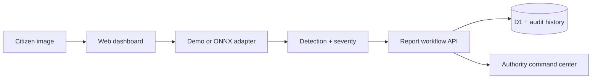

# CivicLens AI

**Explainable urban hazard detection and geospatial reporting platform**

CivicLens AI is a production-shaped civic intelligence platform for reporting, verifying, prioritizing, and resolving road hazards. It combines a responsive operations dashboard, citizen and camera reporting, explainable bounding-box results, severity scoring, duplicate awareness, predictive road intelligence, authority dispatch, a persistent audit trail, city analytics, and a FastAPI/ONNX inference service.

> The deployed UI ships in transparent **demo-inference mode** because trained model weights and a validated road-hazard dataset are not committed to the repository. The adapter contract is ready for a real ONNX detector; benchmark values shown in the demo are product targets, not claimed experiment results.

## Live product

**Production:** https://civiclens-ai.sabrinaisonni945783.chatgpt.site

The deployed dashboard includes:

- Live Dhaka hazard map with type, area, severity, and search filters
- Citizen evidence upload with a three-step AI verification flow
- Explainable bounding-box result and confidence/severity review
- GPS/location capture with duplicate-report warning
- Hazard report center with workflow status updates
- Analytics for detection, resolution, distribution, coverage, and response time
- Road intelligence workspace with corridor condition scores, weather/traffic simulation, predictive maintenance, and sensor health
- Authority command center with SLA prioritization, team assignment, Kanban dispatch, escalation watch, and workflow audit events
- AI model operations with registry state, confidence control, dataset readiness, per-class targets, and production lifecycle visibility
- Eight hazard classes: pothole, plastic waste, waterlogging, open manhole, broken road, illegal dumping, traffic obstruction, and damaged streetlight
- CSV export, responsive navigation, keyboard-friendly controls, and reduced-motion support
- D1-backed report create/read/update API with bounded payloads, ownership, SLA, source, priority, and status history

## Architecture



The hosted application is a Vinext/React Cloudflare Worker. `ai-service/` is an optional standalone FastAPI adapter for teams that want to serve YOLO/RT-DETR models through ONNX Runtime.

## Quick start

Requirements: Node.js 22.13+ and npm.

```bash
npm ci
npm run dev
```

Open the local URL printed by Vite.

Quality checks:

```bash
npm run lint
npm test
```

Generate a D1 migration after schema changes:

```bash
npm run db:generate
```

## Optional AI service

```bash
cd ai-service
python -m venv .venv
source .venv/bin/activate
pip install -r requirements.txt
uvicorn app.main:app --reload
```

The service starts in deterministic demo mode when `MODEL_PATH` is unset. Set `MODEL_PATH` to a compatible YOLO-style ONNX export to enable real CPU inference.

Image and video inference:

```bash
curl -F file=@road.jpg http://localhost:8000/predict-image
curl -F file=@dashcam.mp4 http://localhost:8000/predict-video
```

## Training workflow

The included pipeline validates YOLO labels, trains reproducibly, evaluates the held-out test split, creates plots/confusion matrices through Ultralytics, and exports ONNX.

```bash
cd ai-service
pip install -r training-requirements.txt
python training/validate_dataset.py --data /path/to/dataset
python training/train_yolo.py --data training/data.example.yaml
python training/evaluate_yolo.py --weights runs/civiclens/train/weights/best.pt --data training/data.example.yaml
python training/export_onnx.py --weights runs/civiclens/train/weights/best.pt
```

## Repository map

```text
app/                React dashboard and report API
db/                 D1 schema and database helper
drizzle/            Versioned SQL migrations
ai-service/         FastAPI image/video inference and reproducible training pipeline
docs/               Architecture, API, and model card
tests/              Rendered Worker and API validation tests
.github/workflows/  Continuous integration
```

## Technology

React 19, TypeScript, Vinext, Tailwind CSS, Cloudflare Workers, D1, Drizzle ORM, FastAPI, Pillow, ONNX Runtime adapter, Docker, and GitHub Actions.

## Responsible ML notes

- Never treat demo confidence or target metrics as measured model performance.
- Validate by geographic area, weather, lighting, camera type, and road material.
- Blur faces and license plates before persistence.
- Keep a human in the loop for enforcement or authority actions.
- Document dataset consent, licensing, class balance, and known failure modes.

More details are in [the architecture guide](docs/architecture.md), [API reference](docs/api.md), and [model card](docs/model-card.md).

## License

MIT
