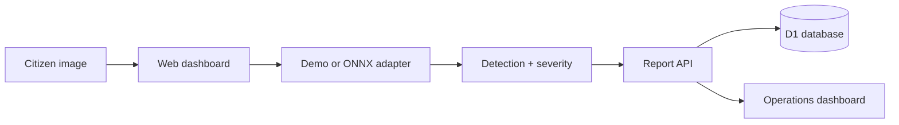

# CivicLens AI

**Explainable urban hazard detection and geospatial reporting platform**

CivicLens AI is a production-shaped civic-technology MVP for reporting, verifying, prioritizing, and resolving road hazards. It combines a responsive operations dashboard, citizen image reporting, explainable bounding-box results, severity scoring, duplicate awareness, a persistent report API, city analytics, and an optional FastAPI/ONNX inference service.

> The deployed UI ships in transparent **demo-inference mode** because trained model weights and a validated road-hazard dataset are not committed to the repository. The adapter contract is ready for a real ONNX detector; benchmark values shown in the demo are product targets, not claimed experiment results.

## Live product

The deployed dashboard includes:

- Live Dhaka hazard map with type, area, severity, and search filters
- Citizen evidence upload with a three-step AI verification flow
- Explainable bounding-box result and confidence/severity review
- GPS/location capture with duplicate-report warning
- Hazard report center with workflow status updates
- Analytics for detection, resolution, distribution, coverage, and response time
- CSV export, responsive navigation, keyboard-friendly controls, and reduced-motion support
- D1-backed `/api/reports` endpoint with validation and bounded payloads

## Architecture



The hosted application is a Vinext/React Cloudflare Worker. `ai-service/` is an optional standalone FastAPI adapter for teams that want to serve YOLO/RT-DETR models through ONNX Runtime.

## Quick start

Requirements: Node.js 22.13+ and npm.

```bash
npm ci
npm run dev
```

Open the local URL printed by Vite.

Quality checks:

```bash
npm run lint
npm test
```

Generate a D1 migration after schema changes:

```bash
npm run db:generate
```

## Optional AI service

```bash
cd ai-service
python -m venv .venv
source .venv/bin/activate
pip install -r requirements.txt
uvicorn app.main:app --reload
```

The service starts in deterministic demo mode when `MODEL_PATH` is unset. Add a compatible ONNX detector and set `MODEL_PATH` to switch the service contract to a real model implementation.

## Repository map

```text
app/                React dashboard and report API
db/                 D1 schema and database helper
drizzle/            Versioned SQL migrations
ai-service/         FastAPI inference adapter
docs/               Architecture, API, and model card
tests/              Rendered Worker and API validation tests
.github/workflows/  Continuous integration
```

## Technology

React 19, TypeScript, Vinext, Tailwind CSS, Cloudflare Workers, D1, Drizzle ORM, FastAPI, Pillow, ONNX Runtime adapter, Docker, and GitHub Actions.

## Responsible ML notes

- Never treat demo confidence or target metrics as measured model performance.
- Validate by geographic area, weather, lighting, camera type, and road material.
- Blur faces and license plates before persistence.
- Keep a human in the loop for enforcement or authority actions.
- Document dataset consent, licensing, class balance, and known failure modes.

More details are in [the architecture guide](docs/architecture.md), [API reference](docs/api.md), and [model card](docs/model-card.md).

## License

MIT
