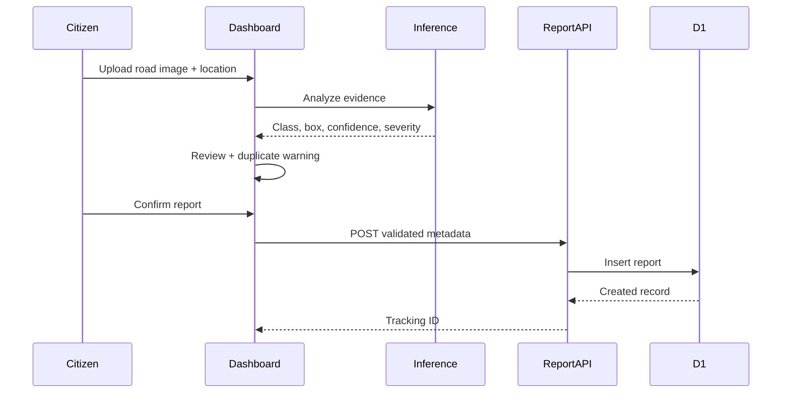

# Architecture

## Product boundary

CivicLens AI is divided into three replaceable layers:

1. **Experience layer** — responsive React dashboard, reporting modal, map, road intelligence, model operations, authority dispatch, explainability, filters, and analytics.
2. **Application layer** — Worker API for validated report creation, retrieval, ownership and workflow updates, plus D1 persistence and status history.
3. **Inference layer** — deterministic browser demo for the public product and a separately deployable FastAPI/ONNX image/video service for trained models.

## Request flow

## Data model

`hazard_reports` stores a public tracking ID, type, severity, confidence, normalized location, area, workflow status, optional coordinates, road coverage, nearby report count, team, source, SLA, priority, and timestamps. `status_history` stores append-only workflow transitions. Uploaded image bytes are intentionally not persisted in the hosted deployment.

## Production extension points

- Replace the deterministic scan in `ReportModal` with the deployed `/predict-image` service URL.
- Add perceptual embeddings and haversine distance for duplicate detection.
- Store sanitized evidence in R2 and retain only the object key in D1.
- Add identity-aware citizen and authority roles.
- Stream dashcam frames to an edge inference queue.

## Security posture

- API payloads are capped and all string/numeric fields are validated.
- The repository contains no credentials or model weights.
- Evidence is previewed in the browser and is not persisted by default.
- Public deployment should add rate limiting and abuse monitoring before large-scale use.
